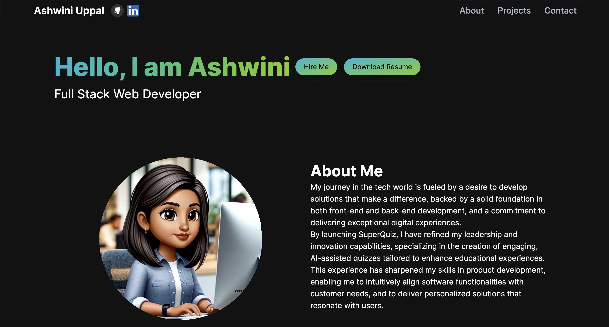

Welcome to my Portfolio!

Click here to view my portfolio:
https://ashuppal.vercel.app/

## About Me

My journey in the tech world is fueled by a desire to develop solutions that make a difference, backed by a solid foundation in both front-end and back-end development, and a commitment to delivering exceptional digital experiences.

By launching SuperQuiz, I've refined my leadership and innovation capabilities, specializing in the creation of engaging, AI-assisted quizzes tailored to enhance educational experiences. This experience has sharpened my skills in product development, enabling me to intuitively align software functionalities with customer needs, and to deliver personalized solutions that resonate with users.

## Getting Started

Open a terminal window and run the following command to clone the repository:

git clone https://github.com/ashuppal/Portfolio-nextJS.git

Create a .env file add the following variable:
RESEND_API_KEY=YOUR_API_KEY

Open a terminal window and run the following commands:

npm run dev

Open http://localhost:3000 with your browser to see the result.

##TECH STACK

- Next.js
- React.js
- Tailwind CSS
- Vercel

## Features

- Responsive Design
- Interactive UI
- Contact Form
- Email Integration

## Screenshots

## Learn More

To learn more about Next.js, take a look at the following resources:

- [Next.js Documentation](https://nextjs.org/docs) - learn about Next.js features and API.
- [Learn Next.js](https://nextjs.org/learn) - an interactive Next.js tutorial.

## Deploy on Vercel

The easiest way to deploy your Next.js app is to use the [Vercel Platform](https://vercel.com/new?utm_source=github&utm_medium=readme&utm_campaign=next-example).

